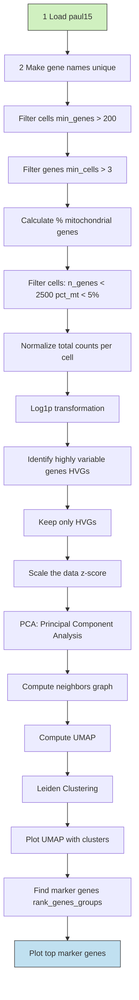

```mermaid
flowchart TB
    A[1 Load paul15] --> B[2 Make gene names unique]
    B --> C[Filter cells min_genes > 200]
    C --> D[Filter genes min_cells > 3]
    D --> E[Calculate % mitochondrial genes]
    E --> F[Filter cells: n_genes < 2500 pct_mt < 5%]
    F --> G[Normalize total counts per cell]
    G --> H[Log1p transformation]
    H --> I[Identify highly variable genes HVGs]
    I --> J[Keep only HVGs]
    J --> K[Scale the data z-score]
    K --> L[PCA: Principal Component Analysis]
    L --> M[Compute neighbors graph]
    M --> N[Compute UMAP]
    N --> O[Leiden Clustering]
    O --> P[Plot UMAP with clusters]
    P --> Q[Find marker genes rank_genes_groups]
    Q --> R[Plot top marker genes]

    style A fill:#d0f0c0,stroke:#333
    style R fill:#c0e0f0,stroke:#333
```
