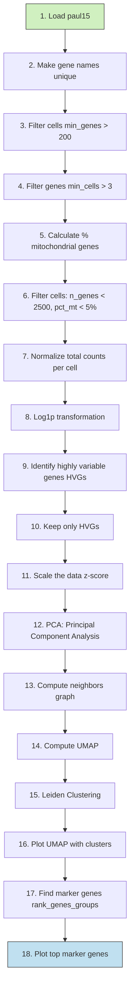

```mermaid
flowchart TD
    A[1. Load paul15] --> B[2. Make gene names unique]
    B --> C[3. Filter cells min_genes > 200]
    C --> D[4. Filter genes min_cells > 3]
    D --> E[5. Calculate % mitochondrial genes]
    E --> F[6. Filter cells: n_genes < 2500, pct_mt < 5%]
    F --> G[7. Normalize total counts per cell]
    G --> H[8. Log1p transformation]
    H --> I[9. Identify highly variable genes HVGs]
    I --> J[10. Keep only HVGs]
    J --> K[11. Scale the data z-score]
    K --> L[12. PCA: Principal Component Analysis]
    L --> M[13. Compute neighbors graph]
    M --> N[14. Compute UMAP]
    N --> O[15. Leiden Clustering]
    O --> P[16. Plot UMAP with clusters]
    P --> Q[17. Find marker genes rank_genes_groups]
    Q --> R[18. Plot top marker genes]

    style A fill:#d0f0c0,stroke:#333
    style R fill:#c0e0f0,stroke:#333
```
