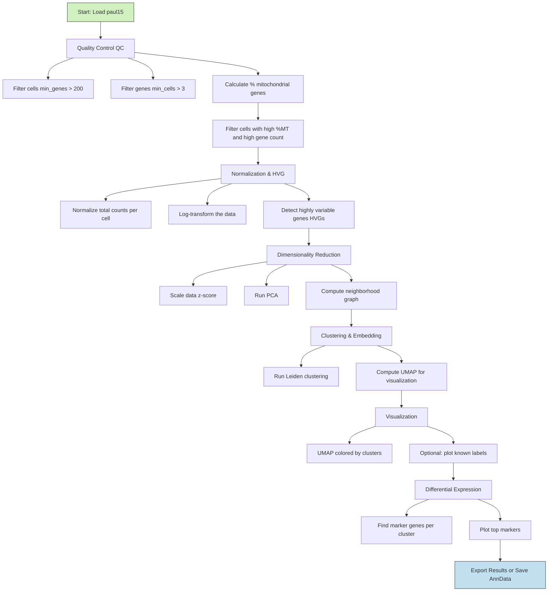

```mermaid
flowchart TD
    A[Start: Load paul15] --> B[Quality Control QC]
    B --> B1[Filter cells min_genes > 200]
    B --> B2[Filter genes min_cells > 3]
    B --> B3[Calculate % mitochondrial genes]
    B3 --> B4[Filter cells with high %MT and high gene count]

    B4 --> C[Normalization & HVG]
    C --> C1[Normalize total counts per cell]
    C --> C2[Log-transform the data]
    C --> C3[Detect highly variable genes HVGs]

    C3 --> D[Dimensionality Reduction]
    D --> D1[Scale data z-score]
    D --> D2[Run PCA]
    D --> D3[Compute neighborhood graph]

    D3 --> E[Clustering & Embedding]
    E --> E1[Run Leiden clustering]
    E --> E2[Compute UMAP for visualization]

    E2 --> F[Visualization]
    F --> F1[UMAP colored by clusters]
    F --> F2[Optional: plot known labels]

    F2 --> G[Differential Expression]
    G --> G1[Find marker genes per cluster]
    G --> G2[Plot top markers]

    G2 --> H[Export Results or Save AnnData]

    style A fill:#d0f0c0,stroke:#333,stroke-width:1px
    style H fill:#c0e0f0,stroke:#333,stroke-width:1px
```
